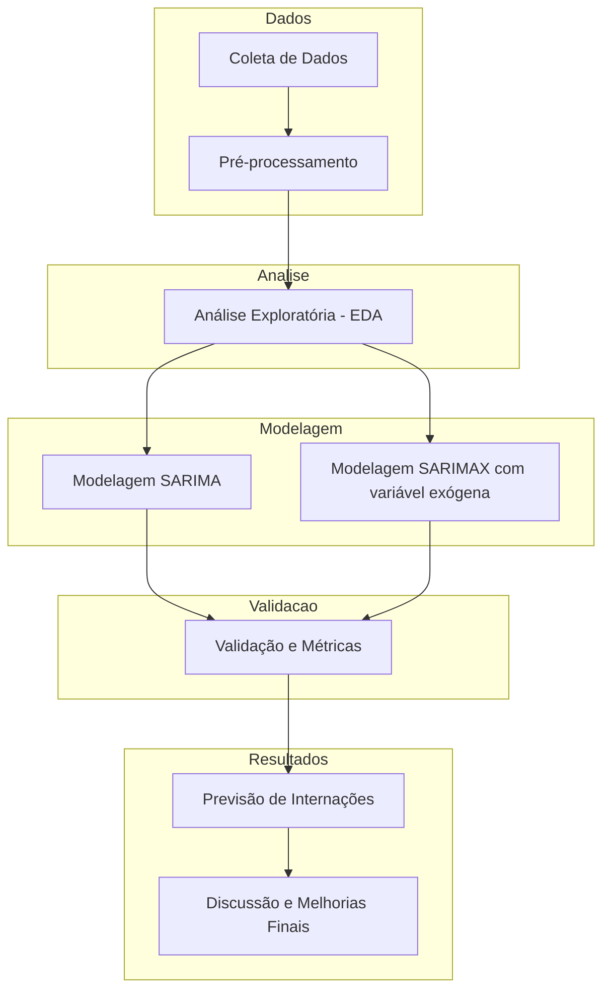

# 🌡️ TEMPREV: Previsão de Temperaturas para Apoio à Saúde Pública

## 👥 Identificação do Grupo

- Emerson Moreira Baliza - 10369752  
- Luciano Guimarães Costa - 10289655  
- Nicolas Pinotti - 10408010  

---

## 📝 Resumo

Este projeto visa desenvolver um sistema preditivo de temperatura média mensal com foco em apoiar a saúde pública na cidade de São Paulo, considerando sua relação com internações por doenças respiratórias. A metodologia envolve modelagem de séries temporais com técnicas estatísticas e de machine learning, com destaque para o modelo SARIMA. O produto gerado, chamado **Temprev**, visa subsidiar ações preventivas, gestão hospitalar e políticas públicas de saúde.

---

## 🧭 Introdução

O aumento das doenças respiratórias em centros urbanos tem sido associado a variações climáticas. Este projeto busca desenvolver uma ferramenta de previsão de temperatura média mensal com dados históricos do INMET (1963–2023), focando na cidade de São Paulo, para apoiar o planejamento em saúde pública. Antecipar variações térmicas pode melhorar a alocação de recursos hospitalares.

---

## 📚 Referencial Teórico

A modelagem de séries temporais envolve identificar tendências, sazonalidade e ruídos. Modelos ARIMA/SARIMA são amplamente usados por sua robustez. Técnicas de decomposição, autocorrelação e testes de estacionariedade (ADF) são essenciais no pré-processamento. Estudos prévios mostram forte relação entre clima e internações respiratórias.

**Referências principais:**

- Box et al. (2015) — *Time Series Analysis: Forecasting and Control*  
- Nascimento et al. (2010) — *Statistical analysis of respiratory admissions and environmental variables*  
- Almeida et al. (2022) — *Climate seasonality and pediatric respiratory hospitalizations*  

---

## 🧩 Diagrama da Solução

---

## 🔍 EDA e Pré-processamento dos Dados

- Fontes: INMET (clima) e DATASUS (internações)
- Pré-processamento em Python: tratamento de datas, padronização, alinhamento mensal
- Sazonalidade forte em internações (picos entre maio e agosto)
- **Teste ADF**:
  - Temperatura: não estacionária (p > 0.05)
  - Internações: estacionária (p < 0.05)
- **Correlação de Pearson**: -0.2192 (fraca e negativa)
- **CCF**: lags significativos em 0, 1, 4–7, 11–12, 16–18, 22–23

📊 Veja os gráficos no [Google Colab](https://colab.research.google.com/drive/1xSnP0P4HXhj4JVlNM2B4KQoY_PdbUTP-)

---

## 🤖 Modelagem

- **Modelos testados**:
  - SARIMA (modelo base)
  - SARIMAX (temperatura como variável exógena)
- **Melhor desempenho**: SARIMAX(2,1,2)x(0,1,[1],12)
- **Ferramentas**:
  - `pmdarima`, `statsmodels`
  - Grid Search para ajuste de hiperparâmetros

---

## 📈 Resultados

- **RMSE (2023)**: 94.69
- **Coeficiente da temperatura**: 9.2091 (p = 0.038) → significância estatística
- **Diagnóstico dos resíduos**:
  - Sem autocorrelação (Ljung-Box)
  - Não normalidade (Jarque-Bera)
  - Heterocedasticidade presente

---

## 💬 Discussão e Conclusão

O modelo SARIMAX capturou padrões sazonais e sugeriu relação significativa entre temperatura e internações. No entanto, há limitações:

- Resíduos não normais e heterocedásticos
- Sinal positivo inesperado no coeficiente da temperatura
- Necessidade de explorar defasagens e novas variáveis

**Próximos passos:**

- Transformações (log, Box-Cox)
- Modelos SARIMAX-GARCH
- Inclusão de novas variáveis (umidade, poluentes)
- Validação cruzada temporal
- Comparação com outros modelos (GAM, XGBoost, LSTM)

---

## 🎥 Apresentação

📽️ https://youtu.be/aiEZHtMJwdg
---

## 📚 Referências Complementares

- BEZERRA, D. C. B.; LUSTOSA, A. L. (2024). *Os efeitos do clima e da poluição do ar sobre as doenças respiratórias*. Revista CEREUS.  
- HYNDMAN, R. J.; ATHANASOPOULOS, G. (2021). *Forecasting: Principles and Practice*. OTexts.  
- INMET. *Dados históricos de temperatura*: https://portal.inmet.gov.br/  
- DATASUS. *TabNet*: http://www2.datasus.gov.br/  
- SILVA, T. S. et al. (2023). *Climate seasonality and lower respiratory tract diseases*. Revista de Saúde Pública.  
- SOUZA, M. L. et al. (2010). *Statistical analysis aiming at predicting respiratory tract disease hospital admissions*. Cadernos de Saúde Pública.
